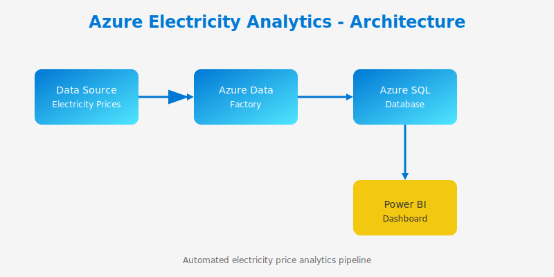

# Azure Electricity Analytics

Automated electricity price analytics pipeline using Azure and Power BI.

## Overview

This project provides an automated pipeline for analyzing electricity prices using Azure cloud services and Power BI for visualization.

## Architecture

The pipeline consists of the following components:

1. **Data Source** - Electricity price data feeds
2. **Azure Data Factory** - Data ingestion and orchestration
3. **Azure SQL Database** - Data storage and processing
4. **Power BI** - Interactive dashboards and reporting

## Getting Started

### Prerequisites

- Azure subscription
- Power BI account
- Azure CLI installed

### Installation

1. Clone this repository
2. Configure your Azure credentials
3. Deploy the Azure resources
4. Connect Power BI to the data source

## Documentation

Additional documentation and images are stored in the `docs/` directory:

- [`docs/images/`](docs/images/) - Contains images used in documentation

## Contributing

Contributions are welcome! Please feel free to submit a Pull Request.

## License

This project is licensed under the MIT License.
